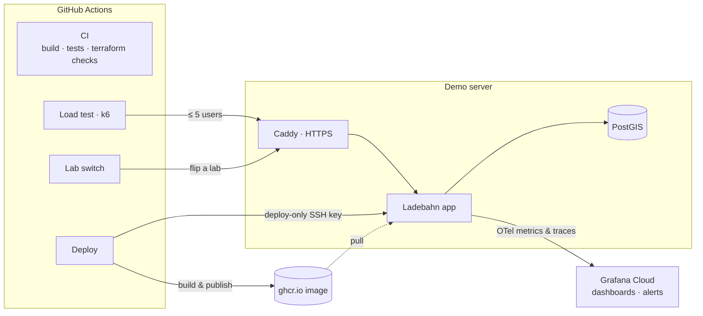

# Ladebahn ⚡

[](https://github.com/perf-eng/ladebahn/actions/workflows/ci.yml)

**A flight simulator for performance engineering.** Ladebahn is a working EV-charging
app — find chargers near you on a map — with a panel of switches that break it in specific,
known ways. Flip a switch, watch latency climb on a live dashboard, find out why, flip it back.
Because you already know the answer, you can measure how good your tools are, and how fast you are.

EV charging was chosen because it contains every interesting way software struggles:
spatial "near me" searches, many people wanting the same charger, thousands of machines
reporting in, and end-of-month billing.

**Live demo:** https://sh.easyhostit.com (a small shared server — started when needed)

---

## What's inside

| Layer | Technology |
|---|---|
| App | Java 21 · Spring Boot 4.1 · Flyway · single-page MapLibre map |
| Database | PostgreSQL 16 + PostGIS 3.6 — our own arm64 image (`docker/postgres`) |
| Observability | OpenTelemetry Java agent → Grafana Cloud (metrics + traces) |
| Load | k6 |
| Infrastructure as code | Terraform — the local database, Grafana dashboards and alerts (`infra/`) |
| Pipelines | GitHub Actions — CI, Deploy, Load test, Lab switch (`.github/workflows/`) |
| Demo hosting | Docker Compose + Caddy (automatic HTTPS) on a small x86 VM |



---

## The lab switches

Each switch breaks the nearby-search endpoint in one known way. They are flipped over HTTP
(token-protected), from a k6 script, or from the **Lab switch** button in GitHub Actions.

| Switch | What it breaks | What you see |
|---|---|---|
| `slow_response` | Adds a fixed delay to every search (default 250 ms, set with `param`) | p95 steps up by exactly that much — the calibration lab |
| `n_plus_one` | Replaces one SQL query with lazy-loaded entities: hundreds of round trips | Latency grows with the result's size; a p99 problem more than a p50 one |
| `drop_index` | Drops the spatial (GIST) index at runtime; recreated when switched off | Every search scans all 20,000 sites instead of a few hundred candidates |

The dashboard overlays each switch's state on the p95 line, so the graph explains itself.

---

## GitHub Actions — the buttons

Open **Actions**, pick a workflow on the left, press **Run workflow**. Works from a phone.

| Workflow | Trigger | What it does |
|---|---|---|
| **CI** | every push and pull request | Builds the app and runs the integration tests against a real PostGIS (arm64); checks every Terraform folder with `fmt` and `validate`. Uses no secrets. |
| **Deploy to demo server** | button | Builds the image for any branch, tag or commit, publishes it to `ghcr.io/perf-eng/ladebahn:<commit>`, switches the server's app container to it, then checks the public site is healthy and returns results. Optional reseed. |
| **Load test (k6)** | button | Sends simulated users at the demo server (**max 5**) or at a throwaway copy of the stack inside GitHub, and can flip a lab switch part-way through. Results page: p50/p95/p99 per phase and a Grafana link to the exact time window. |
| **Lab switch** | button | Turns one lab on or off on the demo server, or just shows every switch's state. Use it on its own or during a load run. |

### Load test (k6) — the options

| Input | Meaning | Default |
|---|---|---|
| `target` | `server` = the public demo · `ci` = a throwaway stack (PostGIS + app) inside the GitHub machine | `server` |
| `vus` | Virtual users. **The demo server is capped at 5**, whatever you type | `5` |
| `duration` | e.g. `90s`, `5m` (server ≤ 15m, ci ≤ 30m) | `5m` |
| `lab` | `none`, `slow_response`, `n_plus_one`, `drop_index` | `none` |
| `lab_param` | Lab setting, e.g. the delay in ms for `slow_response` | app default |
| `switch_on_at` / `switch_off_at` | When the switch goes on and off, from the start of the run | `2m` / `4m` |

Every request is tagged with its phase — `warmup`, `before`, `lab`, `after` — so the results
page reads like a story: *p95 45 ms before the switch, 280 ms while it was on, 40 ms after.*

### Safety rails

- **The demo server is a friend's shared machine.** Load against it is capped at 5 users by the
  workflow *and* by the k6 script, only one load run can target it at a time (so 5 is the total),
  and a run lasts at most 15 minutes. Heavier load goes to the `ci` target, which is thrown away.
- **A switch never stays on by accident.** The load run switches its lab off at the end, again in
  k6's teardown, and once more in an `always()` step that runs even after a failure or a cancel.
- **The deploy key can only deploy.** On the server it is pinned to `deploy/remote-deploy.sh`
  (`command="…",restrict` in `authorized_keys`): no shell, no port forwarding. The script only
  replaces the app container — never the database, its volume or Caddy's certificate.
- **Deploys never overlap**, and every deploy is a commit you can roll back to: re-run
  *Deploy* with the previous commit (each run's page shows it). The running commit is also
  reported to Grafana as `service.version`.
- **Secrets live in GitHub's secret store** and are masked in logs. Note that run pages of a public
  repository are public: anything a step prints (URLs, image names) is visible to everyone.

### Where numbers come from

| Where | Use it for | Don't |
|---|---|---|
| The Mac (local) | The numbers you quote — owned, quiet, saturable hardware | Compare with the other two |
| `ci` target | "Does this switch break it, and how?" at real load | Quote its numbers: shared cloud hardware is noisy |
| Demo server | Showing the story to people, ≤ 5 users | Load testing |

k6's numbers are measured by the client. Server-side p95 in Grafana is computed from histogram
buckets and reads higher when requests cluster inside one bucket — see
[the lab book](docs/lab-book.md) ("the alert is right, the p95 number is not").

---

## One-time setup for the Actions

**1. The demo server** (once): `compose.prod.yaml`, `Dockerfile` and `Caddyfile` used to exist only
on the server; they are in the repository now. Move the server's untracked copies out of the way,
bring its checkout up to date, and confirm nothing live changed:

```bash
cd ~/ladebahn
mkdir -p ~/ladebahn-pre-actions && mv Caddyfile Dockerfile compose.prod.yaml ~/ladebahn-pre-actions/
git pull --ff-only
diff ~/ladebahn-pre-actions/Caddyfile Caddyfile && echo "Caddyfile identical"
diff ~/ladebahn-pre-actions/compose.prod.yaml compose.prod.yaml   # only comments, the image line and the version line differ
```

Nothing restarts here. The running app keeps going until the first *Deploy*.

**2. A deploy-only SSH key** (on your own machine):

```bash
ssh-keygen -t ed25519 -N '' -C ladebahn-github-deploy -f ~/.ssh/ladebahn_deploy
# Pin it to the deploy script on the server — no shell, no forwarding:
echo "command=\"bash /home/<user>/ladebahn/deploy/remote-deploy.sh\",restrict $(cat ~/.ssh/ladebahn_deploy.pub)" \
  | ssh -p <port> <user>@<server> 'cat >> ~/.ssh/authorized_keys'
# The server's host key, so GitHub knows it's talking to the right machine:
ssh-keyscan -p <port> <server> 2>/dev/null
# Test: this must print the running image, and nothing else must be possible
ssh -i ~/.ssh/ladebahn_deploy -p <port> <user>@<server> status
```

**3. GitHub settings** (Settings → Environments / Secrets and variables → Actions):

| Where | Name | Value |
|---|---|---|
| Environment `demo-server` → secrets | `DEPLOY_SSH_KEY` | contents of `~/.ssh/ladebahn_deploy` (the private key) |
| | `DEPLOY_KNOWN_HOSTS` | the `ssh-keyscan` output |
| | `DEPLOY_HOST`, `DEPLOY_PORT`, `DEPLOY_USER` | the server's address, SSH port and user |
| Repository → secrets | `DEMO_LAB_TOKEN` | the server's `LAB_TOKEN` (from its `.env`) |
| | `OTEL_EXPORTER_OTLP_HEADERS` | `Authorization=Basic …` from `otel/env.sh` — only for `ci` runs with telemetry |
| Repository → variables | `OTEL_EXPORTER_OTLP_ENDPOINT` | the Grafana Cloud OTLP endpoint — only for `ci` runs with telemetry |
| | `GRAFANA_URL` | optional: `https://<stack>.grafana.net`, for the "see this run in Grafana" links |
| | `DEMO_URL` | optional: defaults to `https://sh.easyhostit.com` |

**4. The image must be public** so the server can download it without logging in: after the first
*Deploy* run has published it, open the package (`ghcr.io/perf-eng/ladebahn`) → Package settings →
Change visibility → Public. If the first run stops at "Downloading …", this is why — re-run it.

**5. A Grafana dashboard for the `ci` target** (from the Mac, see Terraform below):
`infra/grafana` already lists `ci`; one `terraform apply` creates its dashboard and alert.

---

## Demo in five clicks

1. **Deploy to demo server** → `ref: main` → wait for the green tick and the health check.
2. Open Grafana → Dashboards → Ladebahn → **Ladebahn — server**, last 15 minutes.
3. **Load test (k6)** → `target: server`, `lab: slow_response`, on at `2m`, off at `4m`.
4. Watch the p95 line climb when the switch line steps to 1, and the alert go Pending → Firing.
   Or flip a switch yourself mid-run with **Lab switch**.
5. Open the run's results page: p95 per phase, and the Grafana link to that exact window.

---

## Run it locally (the Mac is the measurement lab)

Needs: Java 21, Docker, k6. Everything is arm64-native on Apple Silicon.

```bash
docker compose up -d                                   # PostGIS on 5432, tuned
./gradlew bootJar
source otel/env.sh                                     # your Grafana Cloud OTLP settings (not in git)
java -javaagent:otel/opentelemetry-javaagent.jar -jar build/libs/ladebahn-0.0.1-SNAPSHOT.jar
curl -X POST -H "X-Lab-Token: local-dev-token" "localhost:8080/admin/seed?scale=large&randomSeed=42"
open http://localhost:8080                             # the map
```

Load with a timed switch — the same script the Actions use:

```bash
BASE_URL=http://localhost:8080 VUS=5 DURATION=5m \
LAB=slow_response SWITCH_ON_AT=2m SWITCH_OFF_AT=4m k6 run k6/lab-run.js
```

Tests: `./gradlew test` (Testcontainers starts the project's own PostGIS image; build it first
with `docker compose build`).

### API at a glance

| Endpoint | Purpose |
|---|---|
| `GET /api/v1/sites/nearby?lat=&lon=&radiusKm=&size=` | The search everything is built around |
| `GET /labs` | Every switch and its setting |
| `POST /labs/{lab}/enable?param=` · `POST /labs/{lab}/disable` | Flip a switch (header `X-Lab-Token`) |
| `POST /admin/seed?scale=small\|medium\|large&randomSeed=42` | Reset to a deterministic dataset (header `X-Lab-Token`) |
| `GET /health/slow?ms=` | Calibration endpoint |
| `GET /actuator/health` | Health |

Large seed = 50 operators, 20,000 sites, 91,314 charge points, 141,565 connectors — clustered
like real cities, with motorway corridors and a skewed mix of small sites and mega-hubs.

---

## Infrastructure as code (Terraform)

| Folder | Manages |
|---|---|
| `infra/playground` | Terraform fundamentals on a toy (variables, validation, locals, `count` vs `for_each`) |
| `infra/local-db` | Ladebahn's PostGIS on the Mac (Docker provider): image, network, a data volume protected by `prevent_destroy`, the tuned container on `127.0.0.1:5433` |
| `infra/grafana` | Grafana Cloud: the Ladebahn folder, one dashboard per environment from one template, a p95 alert rule per environment |

State stays on the Mac and is never committed; credentials come from environment variables.
`infra/walkthrough/` holds one script per learning session that explains, runs and checks every
step. The demo for this layer is in [docs/demo-stage2.md](docs/demo-stage2.md).

---

## Repository layout

```
.github/workflows/   ci.yml · deploy.yml · load.yml · lab-switch.yml
.github/scripts/     helpers used by the workflows
deploy/              remote-deploy.sh — the only thing the deploy key can run on the server
docker/postgres/     our PostGIS image (arm64 and amd64)
infra/               Terraform: playground, local-db, grafana, walkthrough scripts
k6/                  lab-run.js (Actions + local), nearby.js, smoke.js, lab-demo.js
src/                 the Spring Boot app and its tests
docs/                lab-book.md (every experiment and finding) · demo scripts
```

## Findings so far

The [lab book](docs/lab-book.md) records every measurement and surprise — including an N+1 bug
that measured 1.6× or 5.7× depending only on which rows the page held, a seeder bug only a map
could show, and a "20 % stack overhead" that turned out to be histogram-bucket interpolation.
